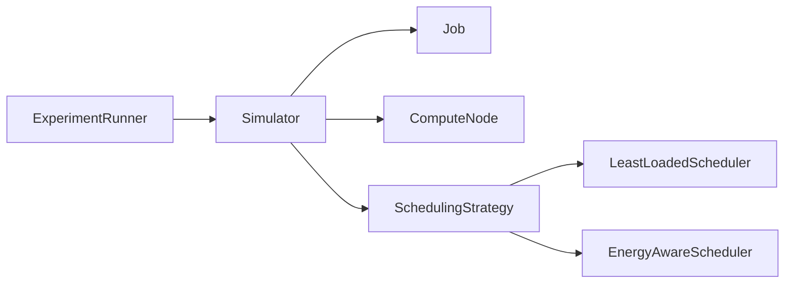

# Orbital Compute Scheduler Simulator

**When does an energy-aware scheduler outperform a simple least-loaded scheduler?**

A small Java 17 project exploring this question with synthetic jobs and orbital compute nodes.
It models resource allocation, input transfers, sunlight/eclipse cycles, and battery constraints—not live telemetry.

The simulator runs both strategies against identical seeded workloads, prints paired comparisons,
and exports the eight results to one CSV file.

## Architecture

```text
orbital-scheduler/
├── Job.java
├── ComputeNode.java
├── SchedulingStrategy.java
├── LeastLoadedScheduler.java
├── EnergyAwareScheduler.java
├── Simulator.java
├── ExperimentRunner.java
├── tests/
│   └── SimulatorTest.java
├── pom.xml
├── README.md
└── .gitignore
```

Java files live directly in the project folder; Maven is configured for this flat layout.
Maven creates `target/` for compiled files, test reports, and the runnable JAR; it is ignored by Git.



`Job` tracks requirements and progress. `ComputeNode` owns active jobs and power accounting.
`Simulator` advances one minute at a time; `SchedulingStrategy` only selects a node.
`ExperimentRunner` creates each seeded scenario twice so both strategies receive identical nodes and jobs.
No runtime libraries are required.

## Scheduling and execution

- **Least loaded:** choose the eligible node with the most free GPUs; break ties by node ID.
- **Energy aware:** minimize `transferMinutes + 30 × (1 − batteryFraction) × sunlightMultiplier`,
  where the multiplier is 0.5 in sunlight and 1 in eclipse. The 30-minute maximum battery penalty
  makes the tradeoff easy to interpret: a transfer delay longer than the battery penalty is not worth it.
  This is a current-state preference, not a forecast.

Both strategies apply GPU capacity as a hard eligibility rule. The energy-aware strategy uses free GPUs
as its first tie-breaker, followed by node ID, so every decision is deterministic.

Eligibility requires enough free GPUs, battery above 20 Wh, and enough energy for the next minute
of the node's workload. Jobs arrive in time/ID order; an unplaceable job does not block smaller jobs.
GPUs stay reserved during transfer and computation. Transfer takes
`ceil(inputGB × 8000 / bandwidthMbps / 60)` minutes (zero for no input), followed by the requested compute duration.

When power is insufficient, all jobs on a node pause with progress and allocations intact.
Baseline power continues and may drain the battery below the work reserve. Sunlight can recharge it.
Completion at the deadline counts as success; otherwise expiration stops work and releases GPUs.
Each simulator is single-use; independent comparisons require fresh jobs and nodes.

## Physical assumptions and sources

| Model choice | Basis and limitation |
|---|---|
| 90-minute orbit, 30-minute eclipse in the example | [NASA's LEO power example](https://ntrs.nasa.gov/api/citations/20030006444/downloads/20030006444.pdf) describes 55 minutes sunlight and 35 minutes eclipse in a 90-minute orbit. Node phases are evenly staggered; the planned stressed scenario uses 35 minutes eclipse. |
| 100 Wh battery; 60 W solar input in the example | [NASA's power survey](https://www.nasa.gov/smallsat-institute/sst-soa/power-subsystems/) includes batteries around 50–100 Wh and power systems in the tens-to-hundreds of watts. These are illustrative choices, not specifications for one spacecraft. |
| 20 W per active GPU unit | Informed by [NVIDIA Jetson Orin](https://www.nvidia.com/en-au/autonomous-machines/embedded-systems/jetson-orin/) embedded module power modes. GPU units are abstract compute allocations, not datacenter GPUs or flight-qualified hardware. |
| 100 Mbps effective bandwidth in the example | [NASA's communications survey](https://www.nasa.gov/smallsat-institute/sst-soa/soa-communications/) reports smallsat downlinks above 100 Mbps. Using this order of magnitude for incoming data is our assumption, not an uplink measurement. |

The **5 W baseline**, **5 W per transferring job**, **20 Wh work reserve**, and **ideal charging efficiency**
are project assumptions. Power is in watts; stored energy is in watt-hours:
`batteryWh += (solarWatts − consumedWatts) / 60` per minute. Solar input is zero in eclipse;
storage stays within 0–100 Wh. Consumption cannot exceed available energy.

## Run

Requires JDK 17 and Maven 3.9+. From the project root:

```sh
mvn test
mvn package
java -jar target/orbital-scheduler.jar
java -jar target/orbital-scheduler.jar --seed 123 --nodes 100
```

The defaults are seed 42 and 10 nodes. `--nodes` accepts 1–1000 and scales each workload with the fleet.
Every run overwrites `results.csv` with four scenarios × two strategies.

## Metrics and results

The CLI reports completed percentage, deadline-miss count/percentage, average waiting minutes,
and total consumed kWh. Waiting includes **queue time and power pauses across all submitted jobs**,
including missed jobs. Energy includes baseline power and incomplete work; solar generation is not subtracted.
Runs must include every deadline.

Four scenarios vary one main pressure at a time. Jobs arrive during the first 180 minutes, request
1–2 GPUs for 5–20 minutes, and have 90-minute deadlines. The default run uses 10 two-GPU nodes:

| Scenario | Jobs | Battery | Effective bandwidth | Input per job | Eclipse |
|---|---:|---:|---:|---:|---:|
| Low workload | 40 | 80–100 Wh | 100 Mbps | 0.1 GB | 30 min |
| High workload | 240 | 80–100 Wh | 100 Mbps | 0.1 GB | 30 min |
| Power constrained | 120 | 25–45 Wh | 100 Mbps | 0.1 GB | 35 min |
| Transfer constrained | 120 | 80–100 Wh | 10/50/100 Mbps | 5 GB | 30 min |

### Default results

Seed 42 with 10 nodes produced:

| Scenario | Strategy | Completed | Missed | Average wait | Energy |
|---|---|---:|---:|---:|---:|
| Low workload | Least loaded / Energy aware | 100% / 100% | 0 / 0 | 0.0 / 0.0 min | 0.486 / 0.486 kWh |
| High workload | Least loaded / Energy aware | 100% / 100% | 0 / 0 | 26.3 / 24.4 min | 1.736 / 1.736 kWh |
| Power constrained | Least loaded / Energy aware | 100% / 100% | 0 / 0 | 0.5 / 0.2 min | 0.955 / 0.955 kWh |
| Transfer constrained | Least loaded / Energy aware | 74.2% / 81.7% | 31 / 22 | 30.2 / 25.9 min | 0.956 / 0.895 kWh |

The energy-aware scheduler mattered most when nodes had very different link speeds and jobs carried
large inputs: it gained 7.5 percentage points in completion, cut misses by nine jobs, reduced mean waiting
by 4.3 minutes, and used 6.4% less energy by avoiding slow transfers. Under light load it made no difference.
Under high load and low-battery conditions it modestly reduced waiting, but every job still completed and
energy was effectively unchanged. These are deterministic outcomes for one synthetic seed, not general
performance claims.

Seven tests cover both strategies' decisions, insufficient resources, power pauses/recovery,
transfer/deadline boundaries with hand-calculated energy, and deterministic replay.

## Limitations

The model uses independent fixed-rate transfers, whole-minute rounding, and a pause-all-jobs rule.
There is no ground-station visibility, network contention, orbital mechanics, thermal model,
hardware calibration, or real execution.
