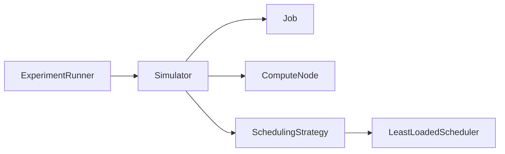

# Orbital Compute Scheduler Simulator

**When does an energy-aware scheduler outperform a simple least-loaded scheduler?**

A small Java 17 project exploring this question with synthetic jobs and orbital compute nodes.
It models resource allocation, input transfers, sunlight/eclipse cycles, and battery constraints—not live telemetry.

**Milestone 1:** the simulation engine and least-loaded baseline work. The energy-aware strategy,
seeded scenarios, and CSV comparison are next. No scheduler comparison results are claimed yet.

## Architecture

```text
orbital-scheduler/
├── Job.java
├── ComputeNode.java
├── SchedulingStrategy.java
├── LeastLoadedScheduler.java
├── Simulator.java
├── ExperimentRunner.java
├── tests/
│   └── SimulatorTest.java
├── pom.xml
├── README.md
└── .gitignore
```

Java files live directly in the project folder; Maven is configured for this flat layout.
Maven creates `target/` for compiled files, test reports, and the runnable JAR; it is ignored by Git.



`Job` tracks requirements and progress. `ComputeNode` owns active jobs and power accounting.
`Simulator` advances one minute at a time; `SchedulingStrategy` only selects a node.
`ExperimentRunner` currently supplies a fixed example. No runtime libraries are required.

## Scheduling and execution

- **Least loaded:** choose the eligible node with the most free GPUs; break ties by node ID.
- **Energy aware (next milestone):** minimize `transferMinutes + 30 × (1 − batteryFraction) × sunlightMultiplier`,
  where the multiplier is 0.5 in sunlight and 1 in eclipse. This penalty is a preference, not a forecast.

Eligibility requires enough free GPUs, battery above 20 Wh, and enough energy for the next minute
of the node's workload. Jobs arrive in time/ID order; an unplaceable job does not block smaller jobs.
GPUs stay reserved during transfer and computation. Transfer takes
`ceil(inputGB × 8000 / bandwidthMbps / 60)` minutes (zero for no input), followed by the requested compute duration.

When power is insufficient, all jobs on a node pause with progress and allocations intact.
Baseline power continues and may drain the battery below the work reserve. Sunlight can recharge it.
Completion at the deadline counts as success; otherwise expiration stops work and releases GPUs.
Each simulator is single-use; independent comparisons require fresh jobs and nodes.

## Physical assumptions and sources

| Model choice | Basis and limitation |
|---|---|
| 90-minute orbit, 30-minute eclipse in the example | [NASA's LEO power example](https://ntrs.nasa.gov/api/citations/20030006444/downloads/20030006444.pdf) describes 55 minutes sunlight and 35 minutes eclipse in a 90-minute orbit. Node phases are evenly staggered; the planned stressed scenario uses 35 minutes eclipse. |
| 100 Wh battery; 60 W solar input in the example | [NASA's power survey](https://www.nasa.gov/smallsat-institute/sst-soa/power-subsystems/) includes batteries around 50–100 Wh and power systems in the tens-to-hundreds of watts. These are illustrative choices, not specifications for one spacecraft. |
| 20 W per active GPU unit | Informed by [NVIDIA Jetson Orin](https://www.nvidia.com/en-au/autonomous-machines/embedded-systems/jetson-orin/) embedded module power modes. GPU units are abstract compute allocations, not datacenter GPUs or flight-qualified hardware. |
| 100 Mbps effective bandwidth in the example | [NASA's communications survey](https://www.nasa.gov/smallsat-institute/sst-soa/soa-communications/) reports smallsat downlinks above 100 Mbps. Using this order of magnitude for incoming data is our assumption, not an uplink measurement. |

The **5 W baseline**, **5 W per transferring job**, **20 Wh work reserve**, and **ideal charging efficiency**
are project assumptions. Power is in watts; stored energy is in watt-hours:
`batteryWh += (solarWatts − consumedWatts) / 60` per minute. Solar input is zero in eclipse;
storage stays within 0–100 Wh. Consumption cannot exceed available energy.

## Run

Requires JDK 17 and Maven 3.9+. From the project root:

```sh
mvn test
mvn package
java -jar target/orbital-scheduler.jar
```

The example runs two nodes and four jobs through the baseline. Command-line options for seed and
node count will arrive with the experiment milestone.

## Metrics and results

The CLI reports completed percentage, deadline-miss count/percentage, average waiting minutes,
and total consumed kWh. Waiting includes **queue time and power pauses across all submitted jobs**,
including missed jobs. Energy includes baseline power and incomplete work; solar generation is not subtracted.
Runs must include every deadline.

Four tests cover baseline selection, insufficient resources, power pauses/recovery, and transfer/deadline
boundaries with hand-calculated energy. Paired experiment results and `results.csv` follow after the second
scheduler. Lower energy alone is not a win if fewer jobs complete.

## Limitations

The model uses independent fixed-rate transfers, whole-minute rounding, and a pause-all-jobs rule.
There is no ground-station visibility, network contention, orbital mechanics, thermal model,
hardware calibration, or real execution.
